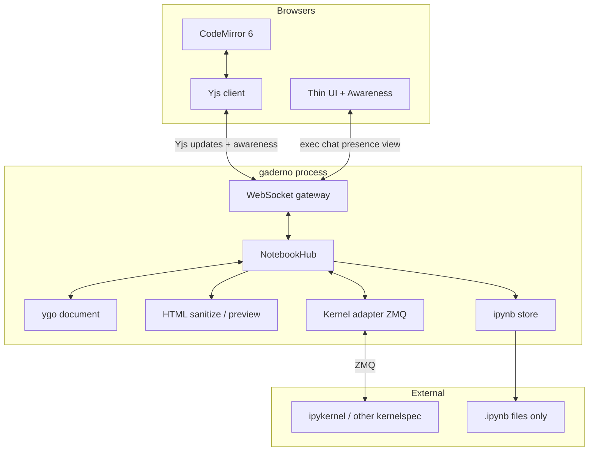
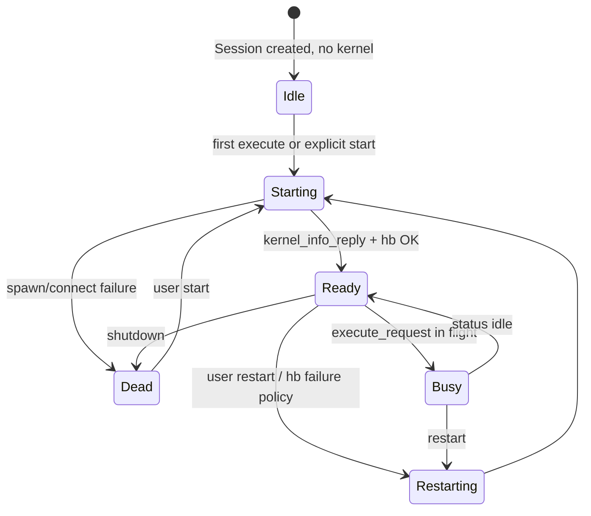
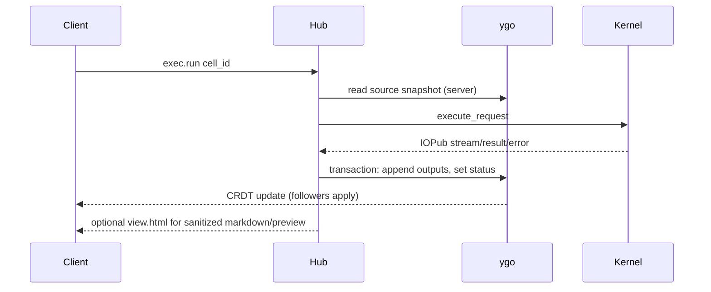
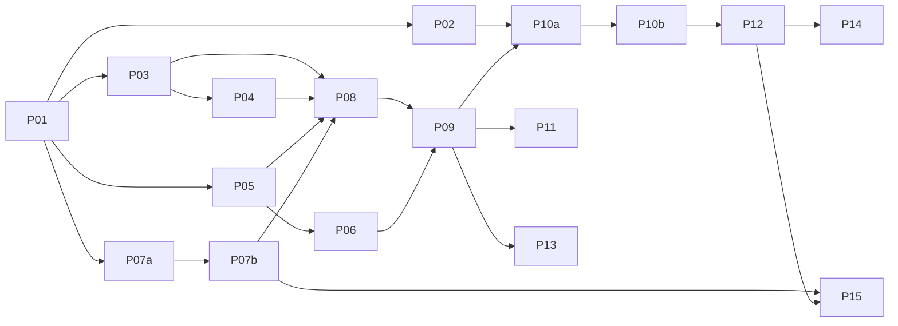

# gaderno Product & Architecture Spec

| Field | Value |
|-------|-------|
| **Title** | gaderno Product & Architecture Spec |
| **Status** | Draft (post grill) |
| **Date** | 2026-07-16 |
| **Repo** | `/home/lucasew/WORKSPACE/OPENSOURCE-own/gaderno` (greenfield; Go 1.26.4 via `mise.toml`) |
| **Audience** | Engineers implementing gaderno |

This document is the **product and architecture specification**. It is not a style guide.

---

## Overview

**gaderno** (Portuguese *caderno* = notebook + Go) is a collaborative notebook server written in Go. It reuses real Jupyter kernels (kernelspecs + ZMQ messaging protocol). The browser is a thin client: CodeMirror for typing, Yjs for optimistic text, and a single WebSocket to a server that holds the canonical live document.

The live document is a **Yjs-compatible CRDT** held in server memory via **[ygo](https://github.com/reearth/ygo)** (pure Go, no CGO). Clients follow the server for everything except speculative text editing. On disk there is **only `.ipynb`**. If the server dies before your changes are acked, those changes are gone.

---

## Background & Motivation

Classic JupyterLab is a heavy SPA that owns much of the document model client-side. Multi-user collaboration and a single server-owned truth are retrofits. gaderno inverts that:

- Collaboration is the product pitch (gdocs-like co-editing + shared execution).
- Server owns the canonical CRDT and all non-text authority (outputs, exec, chrome).
- Kernels stay the Jupyter ecosystem; we do not reimplement Python/R/Julia.

Prior art: Jupyter messaging protocol, Colab (server kernels + collab), Yjs/y-websocket, Phoenix LiveView (server-driven UI inspiration only), GoNB (Go + ZMQ kernels).

---

## Goals & Non-Goals

### Goals (v1)

1. Live multi-client co-editing of notebooks (source + structure + shared outputs).
2. Real Jupyter kernels via standard kernelspecs and protocol 5.x over ZMQ.
3. Server is king: clients are followers except for optimistic text speculation.
4. CRDT document in server RAM via **ygo**; browser **Yjs** speaks the same update protocol.
5. Single WebSocket for CRDT, exec, presence, chat, and view messages.
6. Interop: load/save **nbformat v4 `.ipynb` only** on disk (stable cell ids in metadata).
7. Token-optional gate: no accounts; reachability (+ shared token if set) = full access.
8. Awareness (cursors, names/colors) and **session chat** (RAM-only).
9. Local-first single binary: `gaderno serve` on a workspace directory.
10. Pure Go preferred: ygo + pure-Go ZMQ (`go-zeromq/zmq4`); no CGO required for the default path.
11. Release packaging via **GoReleaser** (multi-OS binaries, checksums, GitHub releases).
12. Kernel discovery initially **mirrors Jupyter’s kernelspec path rules** in Go (no required `jupyter` CLI).

### Non-Goals (v1)

- User accounts, OIDC, per-notebook ACLs, multi-tenant IAM.
- Comments / anchored discussion threads.
- Offline-first / P2P mesh; unacked work survives server death.
- CRDT or op-log sidecar files on disk.
- Full ipywidgets/comm fidelity (ignore/stub unknown comms).
- JupyterHub / K8s control plane / Enterprise Gateway clone.
- Reactive notebook semantics (Observable/Pluto).
- Pixel-perfect JupyterLab clone or extension marketplace.
- Custom keyboard shortcut schemes (Shift-Enter run maps, vim mode, command palette). v1 is **mouse/button + basic focus** only.

### Later (do not paint into a corner)

- Real identity and ACLs.
- Optional durable CRDT snapshot or history.
- Container/bubblewrap kernel sandbox.
- Stdin UI, completion, inspect, widgets.
- Disk-flushed status distinct from server-ack.

---

## Decisions from grill (normative)

| # | Decision |
|---|----------|
| 1 | Product = **live co-editing**, not solo-with-collab-later. |
| 2 | Merge model = **CRDT** (not cell-level LWW CAS, not centralized OT as primary). |
| 3 | Server holds/merges CRDT (**ygo**); always-on peer + persistence projection. |
| 4 | Library = **ygo** (pure Go, Yjs-compatible). Behind a seam if interop fails. |
| 5 | Document shape = **kitchen sink**: structure, source, outputs, exec chrome fields live in the Y.Doc schema. |
| 6 | **Write authority**: server is king; clients are followers. Only the server mutates outputs/exec/kernel-derived fields in the CRDT. |
| 7 | **Text**: optimistic Yjs + CodeMirror (speculate locally). |
| 8 | Sync UX like Docs: **Saving… / Synced** based on **server ack** (in-memory ygo), not disk fsync. |
| 9 | **Auth**: no accounts. Optional shared token; if you can reach the server (and pass token when required), full R/W/X. |
| 10 | **Disk**: **only `.ipynb`**. CRDT is RAM. Server down ⇒ lose unacked client speculation. |
| 11 | Rehydrate with **stable cell ids** stored in ipynb cell metadata (nbformat ids). |
| 12 | **Presence**: Yjs Awareness (cursors, selections, ephemeral name/color). |
| 13 | **Comments**: out of scope. **Session chat**: RAM-only, notebook-scoped, on the same WS. |
| 14 | **Transport**: single WebSocket for all realtime traffic. |
| 15 | **Principle**: speculate on text only; server authority for everything else. |
| 16 | Spec lives in **`SPEC.md`** (not DESIGN.md). |
| 17 | **Packaging:** GoReleaser for tagged releases — **binaries + checksums only** (no Homebrew tap, no Docker-first). Copy config from existing personal/project GoReleaser examples; do not invent a stub-from-scratch layout. |
| 18 | **Kernel discovery:** implement Jupyter’s kernelspec search paths in Go (“copy Jupyter”); do not depend on shelling out to `jupyter kernelspec list`. |
| 19 | **Markdown UX:** toggle — edit source in CM; on blur/exit show server-sanitized HTML preview. |
| 20 | **Large outputs (v1):** cap + truncate only; no blob store. Big/binary plumbing later. |
| 21 | **Structure/authority:** anyone may propose any doc change; **server may reject** (drop/not relay, error to originator). |
| 22 | **Keyboard UX (v1):** no custom hotkey scheme; at most basic focusable controls (tab order, buttons, native focus). |

---

## Vocabulary

| Term | Meaning |
|------|---------|
| **Module** | Package with a small interface and substantial behavior (deep module). |
| **Seam** | Boundary where adapters swap (`KernelConn`, `CRDTDoc`, `NotebookStore`). |
| **Session** | Live binding: one notebook path + ygo doc + ≤1 kernel + connected clients. |
| **Hub** | Per-notebook actor: serializes server-side mutations, owns kernel IOPub apply, fans out WS. |
| **Server ack** | Update accepted into server ygo (and will be relayed). Powers “Synced” UI. |
| **Disk flush** | Debounced write of `.ipynb`. Not what “Synced” means in v1. |

---

## Proposed Design

### High-level architecture



### Authority model

```text
                    ┌─────────────────────────────────────┐
                    │           SERVER (king)             │
                    │  ygo doc · kernel · ipynb flush     │
                    │  sole writer: outputs, exec status  │
                    │  sole writer: structure if we choose│
                    │    server-mediated structure ops    │
                    └─────────────────────────────────────┘
                                      ▲
                      CRDT updates / acks / exec results
                                      │
                    ┌─────────────────────────────────────┐
                    │         CLIENT (follower)           │
                    │  optimistic Y.Text in CodeMirror    │
                    │  requests: execute, interrupt, chat │
                    │  never invents outputs              │
                    └─────────────────────────────────────┘
```

**Speculate on text only.** Keystrokes apply locally via Yjs for caret latency. Server ygo merges and acks; that ack is “Synced.” Structure changes may be applied optimistically if expressed as CRDT array ops that ygo accepts, but **execution and outputs never originate on the client**.

**Kitchen sink vs write roles**

| Subtree | In Y.Doc? | Who writes |
|---------|-----------|------------|
| Cell order / ids / types | Yes | Anyone may propose; **server may reject** |
| Cell source (`Y.Text`) | Yes | Anyone may propose (optimistic); **server may reject** |
| Outputs, execution_count, cell status | Yes | Clients may try; **server rejects** client writes — only hub/IOPub applies |
| Kernel status bar | Yes or side message | **Server only** |
| Awareness (cursors) | Awareness protocol | Clients |
| Chat | **Not** in Y.Doc | Server RAM buffer; WS fan-out |

### 1. Process model (kernels)

**Decision:** One kernel process per live notebook session.

#### Lifecycle



#### Spawn algorithm

1. Resolve kernelspec by name via **Jupyter-compatible discovery** (below); default `python3` from notebook metadata or config.
2. Allocate five free TCP ports; write connection file (mode 0600).
3. Expand kernelspec `argv`; `exec.Command` with cwd = notebook directory.
4. Connect as ZMQ client with pure-Go `github.com/go-zeromq/zmq4` — **IOPub SUB first** (see wire section).
5. Heartbeat + IOPub loops owned by kernel adapter.
6. `kernel_info_request`; Ready only after reply.

#### Kernel discovery (copy Jupyter)

v1 discovers kernelspecs the way Jupyter does, reimplemented in Go — **no subprocess to `jupyter`**.

Search order and locations follow Jupyter’s documented kernelspec paths (user, env, system), including typical roots such as:

- `{sys.prefix}/share/jupyter/kernels` equivalents when a Python env is active (and Jupyter’s user data dir)
- User data: e.g. `~/.local/share/jupyter/kernels` (Linux), platform analogs on macOS/Windows
- System: e.g. `/usr/share/jupyter/kernels`, `/usr/local/share/jupyter/kernels`

Each subdirectory with a `kernel.json` is a kernelspec. **Same name:** first match in Jupyter’s precedence wins (document exact order in code comments against jupyter_core paths).

Optional later: shell-out to `jupyter kernelspec list --json` as a debug fallback — **not** required for MVP.

`uv` in `mise.toml` remains for **dev/test** ipykernel installs, not for production discovery.

#### Channels

| Channel | Use |
|---------|-----|
| shell | execute, complete, inspect, kernel_info |
| iopub | stream, display_data, execute_result, error, status, clear_output |
| stdin | deferred (allow_stdin false in v1) |
| control | interrupt, shutdown |
| hb | liveness (raw ping, not signed Jupyter multipart) |

#### Wire protocol (normative)

Target: Jupyter messaging **5.x** (headers `"version": "5.3"` unless kernel says otherwise).

**Client socket types**

| Channel | Client | Kernel |
|---------|--------|--------|
| shell | DEALER | ROUTER |
| iopub | SUB (subscribe `""`) | PUB/XPUB |
| stdin | DEALER | ROUTER |
| control | DEALER | ROUTER |
| hb | REQ | REP |

**Multipart layout** (shell/control/stdin/iopub):

```text
[identity...] | <IDS|MSG> | HMAC-hex | header | parent_header | metadata | content | [buffers...]
```

HMAC-SHA256 over concatenated JSON frames; empty key ⇒ empty signature (dev only).

**Connect order (avoid IOPub race)**

1. Write connection file.
2. Open IOPub SUB + subscribe + reader.
3. Open shell, control, stdin, hb.
4. Start kernel process.
5. Wait hb or IOPub; then `kernel_info_request` (timeout default 30s).
6. Ready on `kernel_info_reply`.

**execute_request defaults**

```json
{
  "code": "<source snapshot from server ygo at enqueue time>",
  "silent": false,
  "store_history": true,
  "user_expressions": {},
  "allow_stdin": false,
  "stop_on_error": true
}
```

**Interrupt:** honor kernelspec `interrupt_mode` (`signal` vs `message`); clear exec queue on interrupt.

**Client disconnect:** does not kill kernel. Rejoin gets Yjs state vector sync + chat tail + kernel status.

**Server crash:** unacked client edits lost; on-disk ipynb is last flush; orphan kernels reaped best-effort on next start.

**Trust:** kernel runs as the OS user of the gaderno process. cwd is not a sandbox.

### 2. Document model (ygo / Yjs)

Canonical live state is a **Y.Doc** on the server (ygo). Browser holds a Y.Doc replica.

#### Suggested Yjs schema (v1)

```text
Y.Doc
  meta: Y.Map          # kernelspec name, language_info, gaderno fields
  cells: Y.Array       # ordered cell ids (strings)
  cellData: Y.Map      # cell_id -> Y.Map
    type: string       # "code" | "markdown" | "raw"
    source: Y.Text
    metadata: Y.Map
    # server-only writers below:
    execution_count: number | null
    status: string     # idle | queued | running | error
    outputs: Y.Array   # of Y.Map output records
```

Output record map fields roughly match nbformat: `output_type`, `name`, `text` / `data` (mime map), `metadata`, `transient`.

Large binary payloads (**v1**): **no blob store**. Keep outputs inline in CRDT/ipynb with **hard caps**; truncate streams and reject/omit oversized display data with a visible notice. Content-addressed `/blobs/{hash}` is deferred.

#### Server-only apply path for outputs



**Anyone can change anything (propose updates); the server can reject the change.**

- Client updates are applied to server ygo only if they pass policy checks.
- Reject ⇒ do not advance canonical doc for that update; tell originator (`error` / sync nack); do not fan out as accepted truth.
- Default reject policy (v1): client mutations under **outputs / execution_count / cell status / kernel fields**; oversize updates; malformed schema; path escape in metadata if any.
- Source and structure: accept by default (full collab); still reject if caps/schema break.
- Server/hub is the only *successful* writer of execution-derived fields (from IOPub).

#### Execution queue

- One **FIFO** queue per session.
- `run` / `run_all` / `run_from_here` enqueue work.
- At dequeue: snapshot source from ygo; clear outputs for that cell (server transaction); send execute_request.
- `stop_on_error`: cancel remainder of batch.
- Interrupt: clear queue + interrupt kernel.

### 3. Sync protocol

**One WebSocket** per tab: e.g. `GET /ws/notebooks/{id}` after optional ticket.

#### Frame types (logical)

| Kind | Direction | Role |
|------|-----------|------|
| `yjs` / binary sync | both | Yjs update / sync step / awareness (y-protocols style) |
| `exec.cmd` | c→s | run, interrupt, restart, enqueue range |
| `exec.event` | s→c | optional high-level busy toasts (CRDT may already carry status) |
| `chat.send` | c→s | message text |
| `chat.message` | s→c | fan-out |
| `chat.history` | s→c | on join, RAM tail |
| `sync.status` | s→c | optional explicit “synced” if not inferred from yjs ack |
| `view.html` | s→c | sanitized HTML fragments (markdown preview, dangerous mime) when not purely client-rendered |
| `error` | s→c | actionable errors |
| `ping`/`pong` | both | keepalive |

Prefer **binary WS frames** for Yjs updates; JSON text frames for exec/chat/control.

#### “Saving…” / “Synced”

- Client marks dirty on local Y text change.
- Client marks **Synced** when server has **acknowledged** the update into server ygo (implementation: y-protocols ack, or hub seq ack). **Not** disk fsync.
- Debounced **ipynb flush** runs in the background; failures surface as a separate warning (“Disk write failed”), not by reclaiming Synced.

#### Reconnect

1. WS open → auth/token.
2. Yjs state vector exchange; server sends missing updates (full resync from ipynb rebuild if session was cold).
3. Awareness rejoin.
4. Chat history tail from RAM (empty if new session).
5. Kernel status snapshot.

### 4. Source editing (speculate on text)

- CodeMirror 6 bound to `Y.Text` via y-codemirror (or equivalent).
- Local apply immediate (≤16ms feel).
- Remote updates merge via Yjs; caret handled by binding.
- **Flush-before-run:** before `exec.run`, await server ack of pending local updates for that cell (timeout e.g. 500ms → abort run with toast). Prevents executing stale server source.
- Editor hosts must not be destroyed by any HTML morph (`data-gaderno-editor`).

### 5. Auth / identity

- **No accounts.**
- Modes: `auth=none` (loopback only by default) or `auth=token` (shared bearer).
- WS: `Authorization: Bearer` or short-lived ticket from `POST /api/ws-ticket`.
- Non-loopback bind without token: refuse or require explicit `--i-understand`.
- Awareness display name/color: ephemeral, not security.
- Token possession = full execute as OS user. Document that loudly.

### 6. Storage

**On disk: only `*.ipynb`.**

```text
workspace/
  analysis.ipynb     # sole durable notebook artifact
  # no .gaderno CRDT sidecar in v1
```

- Load: parse nbformat → build fresh ygo doc; preserve cell `id` when present; assign UUIDs when missing; write ids back on next save.
- Save: project ygo → nbformat (sources, outputs, metadata, cell ids); atomic write (temp + rename); debounce after server-side mutations.
- External edit of ipynb while session open: v1 either flock + ignore or detect mtime and offer reload (implementer: flock best-effort, document conflict).
- **No durable chat. No durable CRDT blob.**

### 7. Module layout

```text
cmd/gaderno/           # CLI: serve, version
internal/
  app/                 # composition root
  config/              # flags, env
  auth/                # token, tickets, bind policy
  document/            # nbformat types, project ygo↔ipynb, cell ids
  crdt/                # seam over ygo (Doc, ApplyClientUpdate, ServerTxn, Encode)
  session/             # NotebookHub, exec queue, chat buffer, client set
  kernel/              # kernelspec, spawn, ZMQ codec, connection
  render/              # sanitize HTML, markdown→HTML, mime choose
  store/               # filesystem ipynb load/save, flock
  sync/                # WS gateway, yjs bridge, exec/chat frames
  workspace/           # list notebooks under root, path jail
web/static/            # app.js, CM, Yjs, CSS
```

**Seams (Go interfaces, conceptual)**

```go
type CRDTDoc interface {
    ApplyClientUpdate(clientID string, update []byte) (ack []byte, err error)
    ServerTransact(fn func(tx Tx) error) error
    EncodeStateAsUpdate(sv []byte) ([]byte, error)
    // awareness optional helper
}

type KernelConn interface {
    Start(ctx context.Context, spec KernelSpec, cwd string) error
    Execute(ctx context.Context, req ExecuteRequest) (msgID string, err error)
    Interrupt(ctx context.Context) error
    Shutdown(ctx context.Context) error
    Events() <-chan KernelEvent // IOPub + status
}

type NotebookStore interface {
    Load(ctx context.Context, path string) (*nbformat.Notebook, error)
    Save(ctx context.Context, path string, nb *nbformat.Notebook) error
}
```

### 8. MVP scope vs phases

**MVP (ship)**

- Open workspace, list/create ipynb.
- Multi-client Yjs text + structure co-edit via ygo.
- Server-written outputs from ipykernel execute/interrupt/restart.
- Awareness cursors; session chat; sync status = server ack.
- Save ipynb with stable cell ids.
- Token/loopback safety.

**Phase 2**

- Stdin, complete, inspect.
- Output size caps / blob store polish.
- Disk-flush indicator.
- Optional sandbox launcher.

**Phase 3**

- Accounts/ACLs if ever needed.
- Widgets/comms.
- History/time-travel.

### 9. Outputs → HTML

- Server maps mime bundles to safe HTML (`text/plain`, `text/html` sanitized, images, etc.).
- SVG only via `` or sanitized path; default CSP.
- Prefer pushing output data through **CRDT** (kitchen sink) and letting clients render with shared rules **or** push `view.html` for markdown/preview — either is fine if **sanitization runs on server** before untrusted HTML is marked safe.
- Stream coalesce: first chunk ASAP; later chunks ≤33ms coalesce; never block IOPub on WS.
- **Markdown cells:** toggle UX — focused/edit mode uses CodeMirror on `Y.Text`; unfocused shows server-sanitized HTML preview (from current source). No always-on split pane in v1.
- **Keyboard:** no gaderno hotkey layer in v1. Run/interrupt/add-cell are **buttons** (and other explicit controls). Rely on browser/CodeMirror defaults only where unavoidable; do not build a shortcut map or command palette. Controls should be focusable for basic accessibility.

### 10. Latency targets

| Path | Target |
|------|--------|
| Local CM keystroke | ≤16ms feel |
| Server ack (LAN/localhost) | ≤80ms typical after send |
| First stdout visible | ≤100ms after kernel emit (first chunk bypass coalesce) |
| Subsequent stream morph/update | ≤33ms coalesce |
| Flush-before-run wait | ≤500ms or abort |

### 11. Presence & chat

- **Awareness:** cursor, selection, name, color per client.
- **Chat:** notebook session memory ring buffer (e.g. last N messages); join sends tail; not in ipynb; wiped on session end/server restart.
- **No comments.**

---

## API sketch

### HTTP

| Method | Path | Purpose |
|--------|------|---------|
| GET | `/` | workspace UI |
| GET | `/n/{path…}` | notebook page SSR shell |
| GET | `/api/notebooks` | list |
| POST | `/api/notebooks` | create |
| GET | `/api/notebooks/{path}/export` | current ipynb bytes |
| POST | `/api/ws-ticket` | short-lived WS ticket |
| GET | `/ws/notebooks/{path}` | **the** WebSocket |
| GET | `/healthz` | liveness |

`/blobs/{hash}` deferred (large outputs phase).

### CLI

```text
gaderno serve --root DIR [--listen 127.0.0.1:8080] [--token SECRET]
gaderno version
```

---

## Alternatives considered

| Alternative | Why not (for gaderno) |
|-------------|------------------------|
| JupyterLab architecture | Client-owned doc; collab retrofit |
| Cell LWW CAS → later OT | User chose CRDT co-editing as product |
| Automerge/Loro via FFI | CGO/WASM cost; ygo fits pure Go + Yjs editors |
| CRDT sidecar on disk | User: only ipynb; server death loses unacked |
| Full LiveView every keystroke | Typing latency; rejected hybrid |
| Chat on SSE, rest on WS | User chose single WS |
| Real accounts in v1 | User: token/reachability only |
| Outputs multi-master merge | Garbage stdout; server-only writers |

---

## Security & Privacy

### Trust boundary

- Kernel = **same OS user as gaderno**. Arbitrary code execution is the product.
- Shared token = shared root of the notebook workspace **and** host user powers.
- Network expose = intentional remote RCE as that user. Default listen `127.0.0.1`.

### Threat notes

| Threat | Mitigation |
|--------|------------|
| XSS via outputs/markdown | Server sanitize; CSP; SVG discipline |
| Token in query string | Prefer header/ticket; avoid logging tokens |
| Path traversal | Jail all paths under `--root` |
| WS hijack | Origin check optional; token on non-loopback |
| CRDT spam | Size limits, rate limits later |
| Confused deputy “sandbox” | Docs: no false sandbox claims |

---

## Observability

- Structured logs: session id, notebook path, kernel pid, msg_id.
- Metrics: connected clients, exec latency, update bytes, save errors, kernel restarts.
- Dev: optional dump of last N IOPub types; ygo update size histogram.

---

## Rollout

Incremental PRs (below). Each keeps `go test ./...` green. Smoke with real ipykernel via mise/uv before calling MVP done.

Rollback: last good binary; ipynb files remain user data.

---

## Open Questions (remaining)

None that block implementation. Optional later: exact truncate byte defaults.

Large outputs: cap+truncate. Structure: anyone proposes; server may reject.

---

## Risks

| Risk | Severity | Mitigation |
|------|----------|------------|
| ygo ↔ Yjs interop bugs | High | Golden fuzz tests early; CRDT seam |
| Kitchen-sink doc bloat from outputs | Medium | Blob threshold; compact; cap streams |
| Users think Synced = on disk | Medium | Copy: “Synced” not “Saved to disk”; optional later indicator |
| Server death loses work | Accepted | Document; debounce flush aggressively after ack |
| Morph/CM fights | High | No morph inside editor hosts |
| Pure-Go ZMQ edge cases | Medium | KernelConn seam; fixture tests |
| Exposed server = RCE | High | Localhost default; token warning |

---

## Test strategy

| Layer | What |
|-------|------|
| Unit | ipynb ↔ model; sanitize; ZMQ multipart codec; exec queue |
| CRDT | Go ygo self-merge; Go↔Yjs fixture updates (node or golden files) |
| Integration | Hub + mock kernel; two WS clients co-edit + one executes |
| Real kernel | `scripts/kernel_ping.sh`; smoke print(1+1) multi-client |
| Browser | CM + Yjs + awareness manual/playwright later |

---

## Failure catalog

| Failure | Behavior |
|---------|----------|
| Kernel spawn fail | Dead; banner; no run |
| HB death | Dead; clear queue; source kept |
| Disk write fail | Warn; Synced still means RAM ack |
| WS drop | Kernel continues; client resyncs |
| Flush-before-run timeout | Abort that run |
| yjs apply error | Error to client; request full resync |

---

## References

- Jupyter messaging: https://jupyter-client.readthedocs.io/en/stable/messaging.html
- nbformat: https://nbformat.readthedocs.io/en/latest/format_description.html
- ygo: https://github.com/reearth/ygo
- Yjs: https://docs.yjs.dev/
- go-zeromq/zmq4: https://github.com/go-zeromq/zmq4
- GoNB: https://github.com/janpfeifer/gonb
- Idiomorph (if used for non-editor HTML): https://github.com/bigskysoftware/idiomorph

---

## Key Decisions

1. **Live co-editing is the product** — multi-client from day one.
2. **ygo CRDT in server RAM** — pure Go, Yjs-compatible; browser Yjs.
3. **Kitchen-sink schema, asymmetric writers** — outputs/exec server-only; text optimistic.
4. **Speculate on text only; server authority elsewhere.**
5. **Synced = server ack**, not fsync.
6. **Disk = ipynb only**; stable cell ids; no CRDT sidecar; unacked lost on server death.
7. **Single WebSocket** for yjs, exec, awareness, chat, view.
8. **Session chat RAM-only**; no comments.
9. **Awareness** cursors/names in v1.
10. **No accounts**; token/reachability gate; localhost default.
11. **One kernel per notebook**; FIFO exec queue; IOPub → server CRDT transactions.
12. **Deep modules** under `internal/` with CRDT/Kernel/Store seams.
13. **No CGO** on the default path (ygo + go-zeromq/zmq4).
14. **GoReleaser** ships **binaries + checksums only** on GitHub Releases (no Homebrew tap; config from existing examples, not an empty stub).
15. **Kernelspec discovery copies Jupyter’s path rules** in Go; no `jupyter` CLI dependency.
16. **Markdown cells:** toggle edit (CM) ↔ server-sanitized HTML preview.
17. **Large outputs:** v1 = cap and truncate only; blob system later.
18. **Doc mutations:** everyone may propose any change; **server may reject** (outputs/exec fields always rejected from clients).
19. **No custom hotkeys in v1** — buttons and basic focusable controls only (native tab/focus).

---

## Packaging (GoReleaser)

- **Ship:** GitHub Release assets = platform binaries + checksums only.
- **Do not ship (v1 packaging):** Homebrew tap, AUR, nix flake, Docker image with kernels.
- Config: `.goreleaser.yaml` adapted from **existing GoReleaser examples** the author already uses elsewhere — not a greenfield stub checked in “empty for later.”
- CGO: `CGO_ENABLED=0` for release builds (ygo + pure-Go ZMQ).
- Kernels are **not** bundled; host must provide kernelspecs (e.g. ipykernel).
- Trigger: git tags when CI/release workflow is wired; not required for MVP coding.

---

## PR Plan

Ordered increments from empty repo. Toolchain: Go **1.26.4** (mise).

### PR 01 — Scaffold
- `go.mod`, `cmd/gaderno`, `internal/app|config|log`, `/healthz`, `gaderno version|serve`
- GoReleaser config when ready: copy/adapt from known examples (not a placeholder stub). Can land with first tag-ready PR, not blocking scaffold.

### PR 02 — Workspace shell
- List `*.ipynb` under `--root`, path jail, static shell page

### PR 03 — nbformat model
- Load/save ipynb types, cell id assign/preserve, golden fixtures

### PR 04 — store
- Atomic write, debounce helper, flock best-effort

### PR 05 — crdt seam + ygo
- `internal/crdt` over ygo; schema helpers; Go unit tests for text/array merge

### PR 06 — yjs interop fixtures
- Golden updates produced by Yjs (script) applied in ygo and back; CI gate

### PR 07a — kernel codec
- Multipart encode/decode, HMAC, fixtures (no spawn)

### PR 07b — kernel spawn
- Jupyter-compatible kernelspec path discovery (no CLI), ZMQ connect order, hb, execute, `kernel_ping.sh`

### PR 08 — session hub
- Open notebook → ygo from ipynb; exec queue; server output transactions; mock kernel tests

### PR 09 — WebSocket sync
- Yjs bridge, exec frames, awareness pass-through, chat buffer, sync status

### PR 10a — Notebook UI SSR + outputs render
- Page shell, client render from CRDT / view.html, no CM yet

### PR 10b — CodeMirror + Y.Text + flush-before-run
- Editor binding, Synced indicator, multi-client typing

### PR 11 — Auth token + bind safety

### PR 12 — MVP smoke
- Two clients, execute, save ipynb, chat, awareness

### PR 13 — Stream coalesce + output caps (truncate; no blobs)

### PR 14 — Stdin / complete / inspect (phase 2)

### PR 15 — Optional sandbox launcher (phase 2)

### Later — Blob store for large binary outputs



---

## Grill log (compressed)

Product: live co-edit + CRDT + ygo. Server king / client follower. Kitchen-sink doc with server-only outputs. Optimistic text + Docs-like server-ack sync status. No accounts; token/reachability. Disk ipynb only; lose unacked if server dies. Stable cell ids. Awareness yes; comments no; session chat RAM on single WS. Speculate text only. Packaging: GoReleaser binaries+checksums only (no Homebrew; config from examples). Kernel discovery: copy Jupyter paths in Go. Markdown toggle. Outputs cap/truncate. Anyone proposes doc changes; server may reject.

---

*End of spec.*
